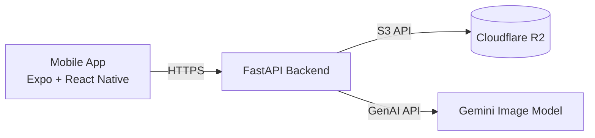

# AI Vastra MVP — System Overview

## Purpose
AI Vastra MVP helps a shop user log in, upload/select garment references, run AI-based visualization, and view/download generated outputs.

## High-level architecture
- **Mobile app (Expo/React Native)** drives user flows and calls backend APIs.
- **FastAPI backend** provides auth, upload, generation, history, and hero listing endpoints.
- **Cloudflare R2 (S3-compatible)** stores uploaded inputs, generated outputs, and history JSON records.
- **Gemini image service** performs image generation using hero + fabric references.

## Runtime components
1. **Session/Auth**
   - Mobile posts shop code + PIN to `/auth/shop`.
   - Backend validates against `backend/shops.json` and returns a simple token.
2. **Upload**
   - Mobile uploads files via multipart to `/upload?kind=...`.
   - Backend stores object in `shops/{shop_id}/{kind}/{date}/{uuid}.{ext}`.
3. **Generate**
   - Mobile calls `/generate` with `fabric_key` + `hero_key`.
   - Backend fetches both objects from R2, sends them to Gemini, stores generated output + history record.
4. **History/Heroes list**
   - Mobile requests `/history` and `/heroes`.
   - Backend returns metadata and signed URLs for direct image access.

## Data boundaries
- All object keys are namespaced under `shops/{shop_id}/...`.
- `/file` endpoint enforces shop-prefix ownership checks before signed redirect.

## Security posture (MVP)
- Auth uses a simple token format (`{shop_id}:{secret}`), suitable only for MVP/internal usage.
- Signed URLs are short-lived (default 1 hour).
- CORS is permissive (`*`) for development.

## Next hardening recommendations
- Replace custom token with JWT (exp, iat, issuer, signature).
- Restrict CORS origins per environment.
- Add structured logging + request IDs.
- Add server-side validation of requested object ownership in generate endpoint.
